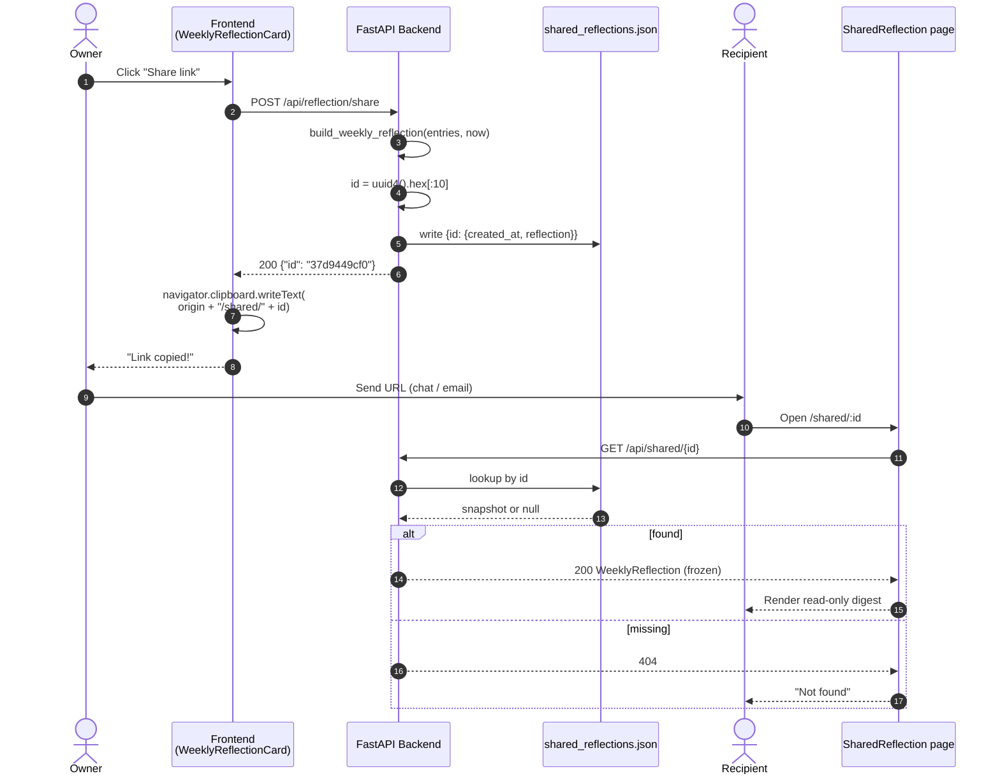
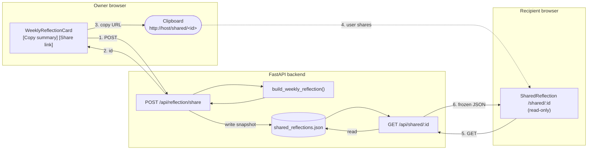

# Shared Reflection — Diagrams

Two views of the same feature: a sequence (what happens in time) and a component map (where things live).

## Sequence

```mermaid
sequenceDiagram
    autonumber
    actor O as Owner
    participant FE as Frontend<br/>(WeeklyReflectionCard)
    participant API as FastAPI Backend
    participant FS as shared_reflections.json
    actor R as Recipient
    participant V as SharedReflection page

    O->>FE: Click "Share link"
    FE->>API: POST /api/reflection/share
    API->>API: build_weekly_reflection(entries, now)
    API->>API: id = uuid4().hex[:10]
    API->>FS: write {id: {created_at, reflection}}
    API-->>FE: 200 {"id": "37d9449cf0"}
    FE->>FE: navigator.clipboard.writeText(<br/>origin + "/shared/" + id)
    FE-->>O: "Link copied!"

    O->>R: Send URL (chat / email)
    R->>V: Open /shared/:id
    V->>API: GET /api/shared/{id}
    API->>FS: lookup by id
    FS-->>API: snapshot or null
    alt found
        API-->>V: 200 WeeklyReflection (frozen)
        V-->>R: Render read-only digest
    else missing
        API-->>V: 404
        V-->>R: "Not found"
    end
```

## Components

```mermaid
flowchart LR
    subgraph Owner["Owner browser"]
        Card["WeeklyReflectionCard<br/>[Copy summary] [Share link]"]
        Clip(["Clipboard<br/>http://host/shared/&lt;id&gt;"])
    end

    subgraph BE["FastAPI backend"]
        RShare["POST /api/reflection/share"]
        RGet["GET /api/shared/:id"]
        Svc["build_weekly_reflection()"]
        Store[("shared_reflections.json")]
    end

    subgraph Recipient["Recipient browser"]
        Page["SharedReflection /shared/:id<br/>(read-only)"]
    end

    Card -->|1. POST| RShare
    RShare --> Svc
    Svc --> RShare
    RShare -->|write snapshot| Store
    RShare -->|2. id| Card
    Card -->|3. copy URL| Clip
    Clip -.->|4. user shares| Page
    Page -->|5. GET| RGet
    RGet -->|read| Store
    Store --> RGet
    RGet -->|6. frozen JSON| Page
```
